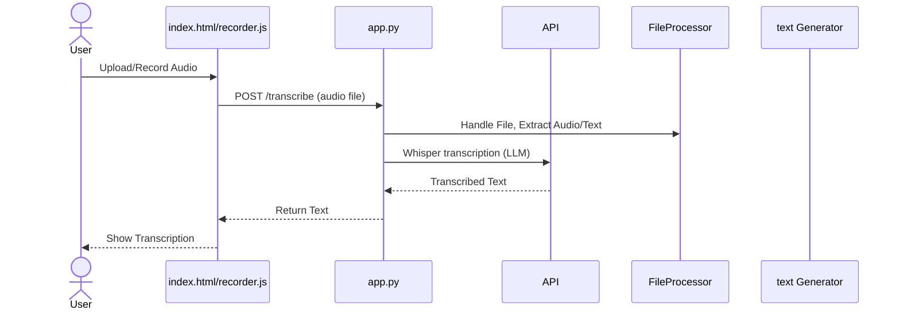

# VoiceScript AI: Real-Time Speech-to-Text Platform 🎙️

[](https://www.python.org/)
[](https://flask.palletsprojects.com/)
[](LICENSE)

## Flow



## Demo
https://github.com/user-attachments/assets/1f9ff73e-77cf-466f-9c52-ca5e393e68a2

## 🎯 Problem Statement

In today's fast-paced digital world, professionals face significant challenges in converting spoken content into written text efficiently. Traditional transcription methods are:
- Time-consuming and labor-intensive
- Prone to human error
- Expensive for large-scale transcription needs
- Not suitable for real-time applications

## 💡 Solution

VoiceScript AI is an innovative speech-to-text platform that provide:
- Instant, highly accurate transcriptions
- Real-time voice-to-text conversion
- Support for multiple audio formats
- User-friendly interface with live preview
- Cost-effective solution for both individuals and enterprises

## 🚀 Key Features

- **Real-Time Voice Recording**: Capture and transcribe speech instantly
- **File Upload Support**: Convert existing audio files to text
- **Live Transcription Preview**: See results as they come in
- **Secure API Key Management**: User-managed API keys for deployment flexibility
- **Modern, Responsive UI**: Clean interface that works on all devices
- **Multiple Audio Formats**: Support for WAV, MP3, M4A, FLAC, OGG, WEBM
- **English Language Support**: High-accuracy transcription for English content

## 🛠️ Technology Stack

- **Frontend**:
  - HTML5, CSS3, JavaScript
  - Modern CSS Grid and Flexbox
  - Font Awesome Icons
  - Responsive Design
  
- **Backend**:
  - Python 3.9+
  - Flask Web Framework
  - API
  - WebSocket for Real-time Communication
  
- **Features**:
  - Browser-based Audio Recording
  - File Upload Handling
  - Secure API Key Storage
  - Error Handling
  - Real-time Status Updates

## 📋 Prerequisites

- Python 3.9 or higher
- API key ([Get one here](https://console.groq.com/))
- Modern web browser
- Internet connection

## ⚙️ Installation

1. Clone the repository:
   ```bash
   git clone https://github.com/yourusername/voicescript-ai.git
   cd voicescript-ai
   ```

2. Create and activate virtual environment:
   ```bash
   python -m venv venv
   source venv/bin/activate  # Linux/Mac
   # or
   venv\Scripts\activate  # Windows
   ```

3. Install dependencies:
   ```bash
   pip install -r requirements.txt
   ```

4. Run the application:
   ```bash
   python app.py
   ```

5. Open your browser and navigate to:
   ```
   http://localhost:8000
   ```

## 🎬 Usage

1. Enter your API key(Groq preferred) in the configuration section
2. Choose between:
   - Live voice recording
   - Audio file upload
3. Start recording or upload an audio file
4. View the transcription in real-time
5. Copy or export the transcribed text

## 🔐 Security

- API keys are stored locally in the browser
- Keys are transmitted securely with each request
- No server-side storage of API keys
- Secure WebSocket connections for real-time data

## 🤝 Contributing

1. Fork the repository
2. Create your feature branch (`git checkout -b feature/AmazingFeature`)
3. Commit your changes (`git commit -m 'Add some AmazingFeature'`)
4. Push to the branch (`git push origin feature/AmazingFeature`)
5. Open a Pull Request

## 📝 License

Distributed under the MIT License. See `LICENSE` for more information.

## 🙏 Acknowledgments

- [Groq AI](https://groq.com/) for their powerful AI API
- [Flask](https://flask.palletsprojects.com/) for the web framework
